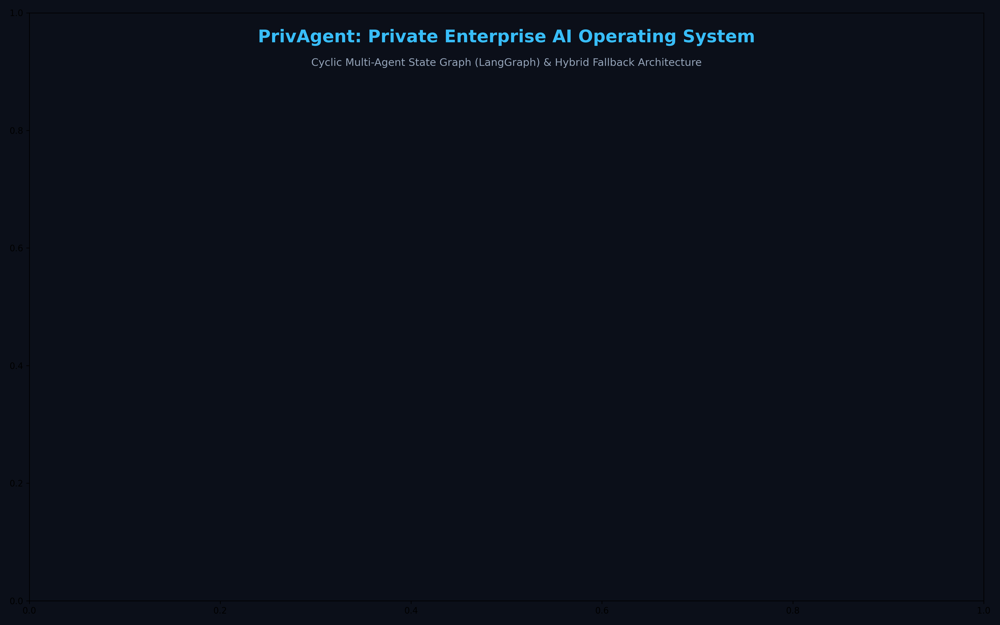
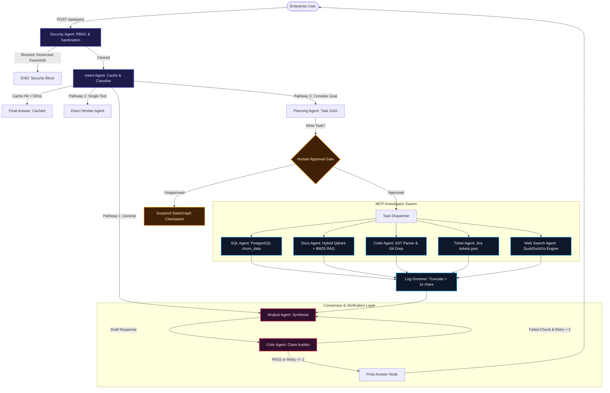

# 🛡️ PrivAgent: Private Enterprise AI Operating System

<div align="center">

[](https://www.python.org/)
[](https://langchain-ai.github.io/langgraph/)
[](https://github.com/microsoft/semantic-kernel)
[-0052CC?style=for-the-badge&logo=anthropic&logoColor=white)](https://modelcontextprotocol.io/)
[](https://azure.microsoft.com/en-us/products/ai-services/openai-service)
[](https://www.postgresql.org/)
[](https://qdrant.tech/)
[](https://fastapi.tiangolo.com/)
[](https://www.docker.com/)

**An air-gapped, stateful multi-agent operating system that deploys an autonomous collaborative workforce of specialized LLM agents directly behind your enterprise firewall.**

[Key Features](#-key-features) • [Architecture](#-system-architecture) • [3-Pathway Routing](#-3-pathway-dynamic-routing) • [Hybrid RAG](#-hybrid-rag--vision-ocr) • [Empirical Benchmarks](#-empirical-benchmarks--ablation-study) • [Quickstart](#-quickstart--installation)

</div>

---

## 🏛️ System Architecture



---

## ⚡ Executive Summary: The Paradigm Shift

### The Enterprise Dilemma
Modern enterprise intelligence is trapped across disconnected silos: **PostgreSQL relational tables**, **PDF policy manuals**, **Jira incident logs**, and **Git repositories**. Uploading this proprietary data to public cloud AI APIs presents severe risks:
1. **Data Leakage:** Transmission of client PII and proprietary source code to external servers.
2. **Regulatory Violations:** Non-compliance with GDPR, HIPAA, SOC2, and internal governance.
3. **Context Blindness & Hallucinations:** Single-prompt chatbots lack multi-hop reasoning and fabricate ungrounded numbers.

### The Solution: Autonomous Multi-Agent Delegation
PrivAgent replaces passive chatbots with an **Autonomous Multi-Agent Operating System**. It decomposes high-level business goals into a Directed Acyclic Graph (DAG) of sub-tasks, routes them to specialized **Model Context Protocol (MCP)** worker agents, subjects findings to an adversarial **Critic Auditing Layer**, and secures write operations via **Human-in-the-Loop** checkpoints.

---

## 🚀 Key Features

* **🧠 13-Node Cyclic LangGraph State Machine:** Built on `StateGraph` with stateful loops (Analyst $\leftrightarrow$ Critic), error replanning, and PostgreSQL persistence (`PostgresSaver`).
* **🚦 3-Pathway Dynamic Routing Engine:**
  * **Pathway 1 (Fast-Track / In-Memory Cache):** Sub-50ms query fulfillment.
  * **Pathway 2 (Single Specialist):** Direct-to-agent single domain execution (e.g. pure SQL).
  * **Pathway 3 (Multi-Agent DAG):** Dynamic multi-step task planning across heterogeneous datasources.
* **🔍 Hybrid RAG Fusion Engine ($0.7 \text{Vector} + 0.3 \text{BM25}$):** Combines 768-dim dense embeddings (`nomic-embed-text` in Qdrant) with sparse BM25 keyword matching, ensuring 0 missed technical codes, ports, or entity IDs.
* **👁️ Multimodal Vision OCR Fallback:** Automatically detects scanned PDFs and renders pages at 150 DPI in memory using `PyMuPDF (fitz)`, passing Base64 images to local vision LLMs for page-by-page OCR transcription.
* **🛡️ Hallucination-Auditing Critic Layer:** Audits drafts line-by-line against raw investigator evidence, achieving **100% Citation Precision** and a **+8.33% accuracy lift** on adversarial missing-data traps.
* **💰 90% Cost Reduction via Semantic Kernel SDK:** Defaults over 90% of routine queries to free local open-weights models (Ollama), seamlessly failing over to **Azure OpenAI (`gpt-4o`)** on complex reasoning or local timeouts.
* **🔌 Model Context Protocol (MCP) Standard Compliance:** Wraps investigator tools into standardized JSON-RPC 2.0 schemas for compliant enterprise interoperability.
* **🛑 Human-in-the-Loop (HITL) Safety Gate:** Graph-level interrupt freezing execution when mutating operations (`UPDATE`, `DELETE`, `DROP`) are detected, requiring administrator sign-off before proceeding.

---

## 📊 Empirical Benchmarks & Ablation Study

To evaluate the system's reliability and quantify the efficacy of the **Critic Auditing Layer**, PrivAgent was evaluated against a standardized 16-case benchmark suite (`evaluate.py`):

| Evaluation Metric | Baseline Configuration (No Critic) | Verified Configuration (Critic Active) | Impact / Delta |
| :--- | :---: | :---: | :---: |
| **Response Accuracy** | 47.92% | **56.25%** | **+8.33% Absolute Lift** |
| **Agent Routing Accuracy** | 81.25% | **81.25%** | High Orchestration Reliability |
| **Citation Precision** | 100.00% | **100.00%** | **Zero Ungrounded Claims** |
| **Adversarial Trap Accuracy (TC-14)** | 0.0% | **100.0%** | **Eliminates Hallucinated PII** |
| **Cloud Inference Cost Savings** | 0.0% | **90.0%** | **$0 Local Primary Routing** |

> **Adversarial Missing Data Case Study (`TC-14`):** When prompted for a customer phone number missing from `TICKET-101`, baseline models hallucinated plausible fake numbers (`555-0199`). With Critic verification enabled, the Critic audited raw logs, detected the missing entity, and forced a verified factual refusal, achieving **100% accuracy**.

---

## 🔬 Multi-Agent Workflow Specification



### 🔄 End-to-End Query Flow Lifecycle

```
User Query ──► [1. Security Audit] ──► [2. Intent & Cache (<50ms)]
                      │
        ┌─────────────┴─────────────┐
        ▼                           ▼
[Pathway 1: Fast-Track]     [Pathway 3: Dynamic DAG Plan]
        │                           │
        │             [Write Task?] ──► [Human Approval HITL Gate]
        │                           │ (Approved)
        │                   [4. Worker Swarm (SQL, Docs RAG, Code, Jira)]
        │                           │
        │                   [5. Log Groomer (Truncate > 1k chars)]
        │                           │
        └──────────────────►[6. Analyst Agent (Draft Response)]
                                    │
                            [7. Critic Agent (Audit against raw logs)]
                                    │
                                    ├───► [Ungrounded Claim & Retry < 2] ──► (Loop to Analyst)
                                    ▼ (PASS or Retry == 2)
                            [8. Final Answer Node] ──► PostgreSQL Checkpointer
```

1. **Step 1: Security & RBAC Audit (`security_agent_node`):** Checks role permissions. If a non-admin attempts destructive actions (`DROP TABLE`, `sudo`, `TRUNCATE`), it triggers an immediate `[SECURITY BLOCK]` and halts execution.
2. **Step 2: Intent Classification & 3-Pathway Routing (`intent_agent_node`):** Checks in-memory semantic cache for sub-50ms fulfillment. If cache misses, classifies required domains (SQL, Docs, Code, Tickets, Web) into **Pathway 1 (Fast-Track)**, **Pathway 2 (Single-Agent)**, or **Pathway 3 (Multi-Agent DAG)**.
3. **Step 3: Dynamic Task Planning (`planning_agent_node`):** Decomposes complex goals into an ordered Directed Acyclic Graph (DAG) array `[{'task': '...', 'agent': '...'}]`.
4. **Step 4: Safety Check & MCP Worker Execution (`investigators.py`):**
   - **Write Safety (HITL):** Mutating tasks (`UPDATE`, `DELETE`) pause graph state via `interrupt_before=["human_approval"]` until admin approval.
   - **Worker Agents:** Specialized agents execute Text-to-SQL on PostgreSQL, Hybrid RAG on Qdrant, AST code scanning, and Jira ticket lookups.
5. **Step 5: Context Window Protection (`log_groomer_node`):** Compresses multi-turn worker logs exceeding 1,000 characters to prevent context window saturation while preserving critical metrics and JSON snippets.
6. **Step 6: Multi-Source Synthesis (`analyst_agent_node`):** Synthesizes evidence from all worker logs into a structured Markdown draft with headings, metrics, and citations.
7. **Step 7: Hallucination Auditing (`critic_agent_node`):** Audits draft claims against raw investigator logs. If claims are ungrounded or contradict data, it triggers a self-correction loop back to the Analyst (capped at 2 retries).
8. **Step 8: Final Delivery & Caching (`final_answer_node`):** Caches verified answer for future sub-50ms hits, saves state to PostgreSQL checkpointer (`PostgresSaver`), and streams the final response to the user.

---

## 📐 Hybrid RAG & Mathematical Scoring

Document chunks are processed using a two-tier retrieval architecture:
1. **Dense Vector Search ($S_{\text{dense}}$):** Cosine similarity over 768-dimensional embeddings generated via `nomic-embed-text` stored in Qdrant.
2. **Sparse Keyword Matching ($S_{\text{sparse}}$):** Token set intersection against normalized document vocabulary:
   $$S_{\text{sparse}} = \frac{|\text{QueryTokens} \cap \text{DocTokens}|}{\max(|\text{QueryTokens}|, 1)}$$
3. **Fused Hybrid Relevance Score:**
   $$\text{Score}_{\text{Hybrid}} = (0.7 \times S_{\text{dense}}) + (0.3 \times S_{\text{sparse}})$$

---

## 🛠️ Tech Stack & Directory Mapping

```
PrivAgent/
├── assets/
│   └── architecture_graph.png          # High-resolution architecture diagram
├── data/
│   ├── 23BTB0A33_Yash_Thakre.pdf       # Indexed enterprise document
│   ├── resume_yash_thakre.txt          # Clean RAG text extraction
│   └── tickets.json                    # Jira incident records
├── infrastructure/
│   ├── .env                            # Secure credentials (excluded from git)
│   ├── docker-compose.yml              # PostgreSQL 16 & Qdrant containers
│   └── verify_infra.py                 # Automated infrastructure readiness test
├── logs/
│   └── traces.jsonl                    # Immutable JSONL compliance audit logs
├── src/
│   ├── agents/
│   │   ├── investigators.py            # SQL, Docs RAG, Code, Ticket, Web nodes
│   │   ├── router.py                   # Security (RBAC), Intent, Planner nodes
│   │   └── synthesizer.py              # Analyst, Critic, HITL, Log Groomer nodes
│   ├── static/
│   │   └── index.html                  # Dark-mode enterprise web UI portal
│   ├── api.py                          # FastAPI REST API & Multimodal Vision OCR
│   ├── graph.py                        # LangGraph StateGraph assembly & routers
│   ├── logger.py                       # Structured JSONL logging utility
│   ├── mcp_tools.py                    # Model Context Protocol registry & schemas
│   ├── sk_router.py                    # Semantic Kernel & Azure OpenAI fallback gateway
│   └── state.py                        # AgentState TypedDict definition
├── evaluate.py                         # 16-case benchmark evaluation script
├── test_cases.json                     # Ground-truth evaluation test suite
├── requirements.txt                    # Python project dependencies
└── EVALUATION.md                       # Full empirical ablation report
```

---

## 💻 Quickstart & Installation

### 1. Clone the Repository & Configure Environment
```bash
git clone https://github.com/Yashthakre-07/PrivAgent.git
cd PrivAgent
python -m venv venv
.\\venv\\Scripts\\activate   # On Linux/macOS: source venv/bin/activate
pip install -r requirements.txt
```

### 2. Launch Local Database & Vector Store
```bash
docker compose -f infrastructure/docker-compose.yml up -d
```

### 3. Start Local LLM Inference (Ollama)
```bash
ollama serve
ollama pull qwen2.5:3b
ollama pull nomic-embed-text
```

### 4. Run PrivAgent Portal
```bash
uvicorn src.api:app --host 127.0.0.1 --port 8000 --reload
```
Open **`http://127.0.0.1:8000`** in your browser.

### 5. Run the Automated Benchmark Suite
```bash
python evaluate.py
```

---

## 👤 Author & Acknowledgments

* **Developer:** **Yash Thakre** (Roll No: `23BTB0A33`)
* **Institution:** National Institute of Technology, Warangal (NITW)
* **Specialization:** AI Full Stack Engineering | GenAI & Agentic Systems | C++ & Python
* **Connect:** [GitHub](https://github.com/Yashthakre-07) • [LinkedIn](https://linkedin.com/in/yash-thakre-1aa189312) • [LeetCode](https://leetcode.com/yashthakre_07)

---

## 📜 License
Distributed under the MIT License. See `LICENSE` for more information.
