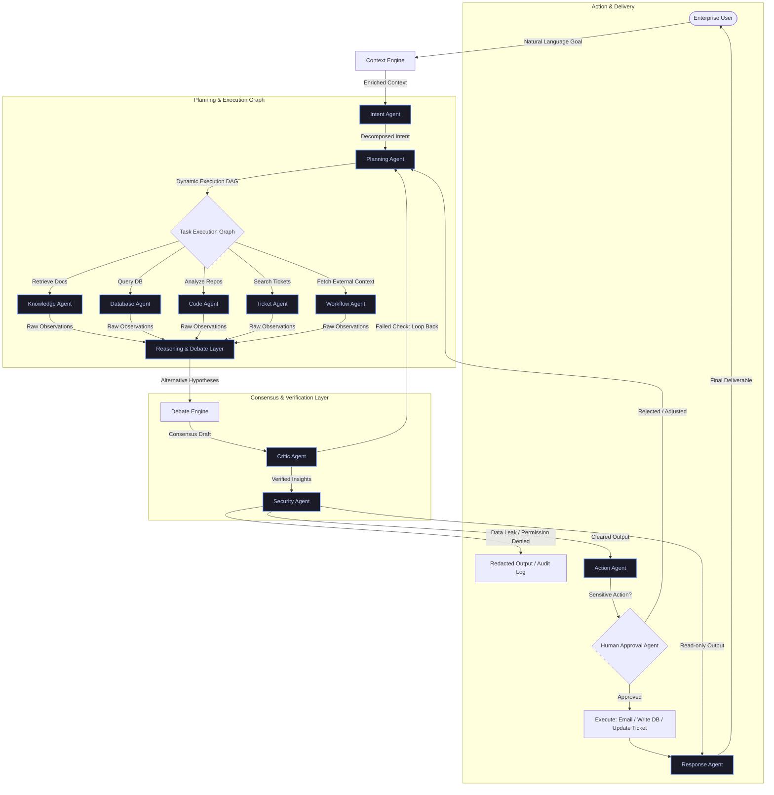

# PrivAgent: Architecture & Technology Stack Reference

This document outlines the architectural design, agent workflows, and technology stack of **PrivAgent**, an enterprise-grade private AI operating system. PrivAgent is designed to operate securely within an enterprise firewall to enable autonomous, multi-agent collaboration with zero data leakage.

---

## 1. System Overview

PrivAgent is a stateful, cyclic multi-agent operating system. Unlike simple, single-prompt chat assistants, PrivAgent manages complex enterprise goals by decomposing tasks, gathering information from heterogeneous data sources, facilitating debate to reduce hallucinations, and executing actions with human-in-the-loop oversight.

### High-Level Workflow
```
[User Goal] ──> [Context & Intent] ──> [Dynamic Plan (DAG)] ──> [Investigator Agents]
                                                                        │
[Cleared Output/Action] <── [Security & HITL] <── [Debate & Critic] <───┘
```

---

## 2. Dynamic Execution & Multi-Agent Graph

PrivAgent is built using a cyclic graph architecture, allowing agents to route tasks, recover from errors, and dynamically replan when assumptions change or new data is gathered.



---

## 3. The Agent Ecosystem

PrivAgent divides responsibilities among highly specialized, sandboxed agent nodes:

### A. Planning & Orchestration
*   **Intent Agent:** The system router. Parses the goal, determines systems to query, and classifies security level.
*   **Planning Agent:** The manager. Decomposes intents into a Directed Acyclic Graph (DAG) of sequential or parallel tasks. Performs dynamic replanning upon downstream agent failure.

### B. Investigators (Data Gatherers)
*   **Knowledge Agent:** Queries unstructured files (PDFs, meeting transcripts, emails) using hybrid search (vector similarity + sparse BM25) and local cross-encoder re-ranking.
*   **Database Agent:** Translates questions to SQL, runs them inside read-only sandboxed database environments, and validates the output.
*   **Code Agent:** Explores codebases using AST parsers, grep search, and git diff tracking.
*   **Ticket Agent:** Connects to issue tracking software (e.g., Jira, ServiceNow) to pull transaction status and incident logs.
*   **Workflow Agent:** Connects to external systems or enterprise APIs to retrieve broader organizational context.

### C. Alignment, Debate & Quality Assurance
*   **Debate Engine:** Spawns specialized debate perspectives (Market-centric, Operations-centric, Product-centric) to discuss root causes and avoid confirmation bias.
*   **Judge Agent:** Synthesizes the debate, requiring each conclusion to be linked to concrete source citations.
*   **Critic Agent:** Conducts post-debate verification to eliminate logical inconsistencies and ensure math matches raw database output.

### D. Governance & Execution
*   **Security Agent:** Enforces Role-Based Access Control (RBAC), sanitizes input prompts, and redacts PII or sensitive metrics based on user clearance levels.
*   **Human-in-the-Loop (HITL) Agent:** Pauses execution for high-risk write-actions (e.g., updating database cells, sending emails), presenting proposals for human review and validation.
*   **Action Agent:** Executes authorized writes/actions upon HITL approval.

---

## 4. Enterprise Memory & Graph-RAG

Rather than relying purely on vector embeddings which lose relationships, PrivAgent features an **Enterprise Knowledge Graph** (implemented using **Neo4j**). This structure supports:
*   **Multi-hop Retrieval:** Link developers, code commits, customer incidents, and projects together.
*   **Temporal Labels:** Ensures temporal alignment by annotating relationships with valid dates.
*   **Entity Resolution:** Maps multiple naming variants (e.g., "Proj Sentinel", "Sentinel App") to a single canonical node.

---

## 5. Technology Stack (What We Are Using)

PrivAgent is constructed utilizing a highly optimized, fully open-source and self-hostable technology stack to ensure complete privacy.

| Category | Technology | Rationale & Usage |
| :--- | :--- | :--- |
| **Local LLMs** | `Qwen-2.5-Instruct` <br> `Llama-3-Instruct` <br> `DeepSeek-Coder-V2` | High-quality open weights models serving as the core brains for reasoning, instruction following, and code parsing. |
| **Agent Framework** | `LangGraph` | Empowers stateful multi-agent conversations, loops, conditional routing, and Human-in-the-Loop interruptions. |
| **Vector Database** | `Qdrant` | Serves as the high-performance vector search engine for dense document retrieval. |
| **Graph Database** | `Neo4j` | Hosts the Enterprise Knowledge Graph to handle multi-hop relational context. |
| **Relational Database** | `PostgreSQL` | Central store for LangGraph persistent session state (using `PostgresSaver`), agent audit logs, and self-hosted Langsmith observability data. |
| **Inference Server** | `vLLM` / `Ollama` | Provides high-throughput inference with continuous batching and quantization support (AWQ, GGUF) for running on consumer GPUs (e.g., A10G, RTX 4090). |
| **Backend API** | `FastAPI` | Asynchronous backend API to coordinate agents, manage sessions, and expose endpoints. |
| **Observability** | `OpenTelemetry` & `Langsmith` | Local auditing and tracing of agent tool usage, latency, and prompt patterns (self-hosted enterprise deploy backed by PostgreSQL). |
| **Deployment** | `Docker` & `Kubernetes` | Provides secure, reproducible microservice setups for on-premise environments. |
