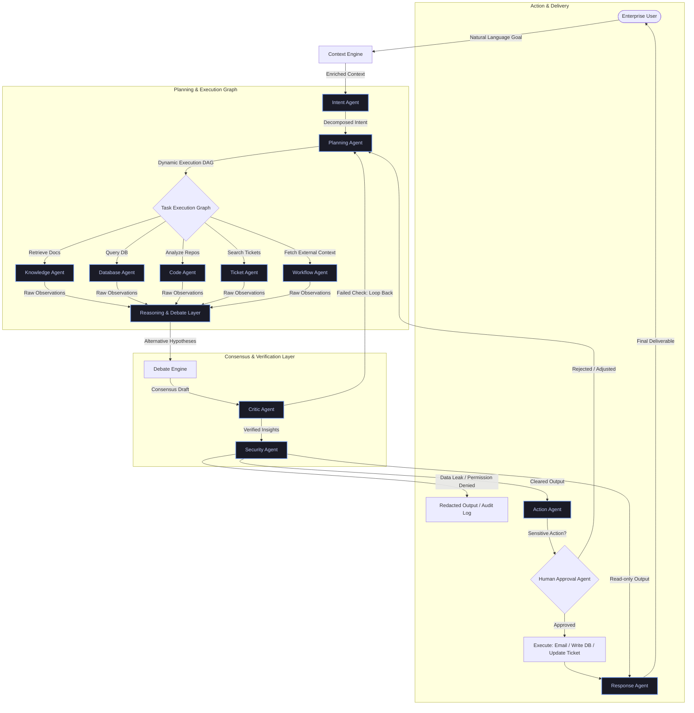

# PrivAgent: Private Enterprise AI Operating System

> Deploys a collaborative, secure workforce of autonomous agents directly within your enterprise firewall.

---

## 1. Executive Summary & The Paradigm Shift

### The Core Problem
Today's enterprise data is trapped, siloed, and sensitive. From proprietary source code and customer support histories to internal databases, PDFs, and meeting transcripts, the raw materials of business intelligence are distributed across disconnected systems.

Uploading this data to public cloud AI APIs presents unacceptable risks:
*   **Data Leakage:** Proprietary IP and client PII may train external models.
*   **Compliance Violations:** GDPR, HIPAA, SOC2, and internal governance forbid external data movement.
*   **Context Isolation:** Standard chatbots process one prompt at a time, completely unaware of organizational relationships, previous decisions, or cross-departmental impacts.

As a result, employees spend hours copying and pasting information across multiple portals to complete simple analytical tasks.

### The Shift: Assistant vs. Operating System
Typical AI projects build "Chatbots" or simple "PDF RAG Apps." These are search-centric, requiring constant human driving:

```
Human ──[Query]──> Chatbot ──[Text Response]──> Human (Must verify, clean, format, and execute)
```

**PrivAgent** introduces a new paradigm: **Autonomous Delegation**. It acts as an **Enterprise AI Operating System** that accepts a high-level goal, devises an execution plan, orchestrates specialized agents to retrieve and analyze multi-source data, subjects its findings to debate, filters the results through a localized security engine, and coordinates actions with human-in-the-loop validation:

```
Human ──[Goal]──> PrivAgent OS ──[Executes Plan, Cross-References, Debates, Cleans]──> Verifiable Action / Insight
```

---

## 2. System Architecture

PrivAgent uses a stateful, cyclic multi-agent graph architecture. By employing **LangGraph**, it enables structured agentic workflows, branching, error recovery, and human-in-the-loop interruptions.



---

## 3. The Multi-Agent Ecosystem

Each agent in PrivAgent is a specialized LLM node with custom prompts, narrow system instructions, and restricted toolkits.

### 3.1 Planning & Control Agents

#### Intent Agent
*   **Role:** The system's gateway and router.
*   **Function:** Parses the user's high-level goal, determines which data systems need querying, identifies constraints, and assesses safety levels.
*   **Output:** An intent schema containing capability requests, target domains, and safety classifications.

#### Planning Agent
*   **Role:** The project manager.
*   **Function:** Dynamically decomposes the Intent schema into a Directed Acyclic Graph (DAG) of sequential and parallel tasks. It monitors task execution and can perform *dynamic replanning* if a downstream agent fails or returns unexpected results.
*   **Example Plan:**
    1.  *Query Database Agent* for regional Q2 sales metrics.
    2.  *Query Knowledge Agent* for Q2 marketing strategy documents.
    3.  *Trigger Analytics Agent* to correlate sales drops with marketing launch delays.

---

### 3.2 Investigator Agents (The Evidence Gatherers)

```
┌─────────────────────────────────────────────────────────────────────────────────┐
│                          INVESTIGATOR AGENTS TOOLKITS                           │
├───────────────────┬───────────────────┬───────────────────┬─────────────────────┤
│  Knowledge Agent  │  Database Agent   │    Code Agent     │    Ticket Agent     │
├───────────────────┼───────────────────┼───────────────────┼─────────────────────┤
│ • Hybrid RAG      │ • Text-to-SQL     │ • AST Parser      │ • Jira API Client   │
│ • Sparse (BM25)   │ • Schema Validator│ • Git Diff Viewer │ • Issue Searcher    │
│ • Dense Embeddings│ • Query Optimizer │ • Grep Search     │ • Status Updater    │
│ • Cross-Encoders  │ • Safe Execution  │ • Linter          │ • Comment Poster    │
└───────────────────┴───────────────────┴───────────────────┴─────────────────────┘
```

#### Knowledge Agent (Memory & Unstructured Data)
*   **Input:** Natural language document retrieval queries.
*   **Source Data:** PDF SOPs, policy documents, emails, meeting transcripts, research logs.
*   **Capabilities:** Performs hybrid search (dense vector similarity + sparse BM25) and passes the top candidates through a local re-ranking cross-encoder (e.g., BGE-Reranker) to select the most contextually relevant snippets.

#### Database Agent (Structured Data)
*   **Input:** Natural language data retrieval requests.
*   **Source Data:** PostgreSQL, MySQL, Snowflake, local analytical databases.
*   **Capabilities:** Automatically inspects schema definitions, generates context-specific SQL queries, runs them inside a read-only sandboxed database view, catches syntax errors, and validates results before passing them back.

#### Code Agent (Software repositories)
*   **Input:** Code analysis, regression reviews, or architectural queries.
*   **Source Data:** Monorepos, internal Git systems.
*   **Capabilities:** Uses Abstract Syntax Tree (AST) parsers, git diff tools, and local grep searches to pinpoint code modules, review pull requests, identify changes, and propose localized fixes or write unit tests.

#### Ticket Agent (Task & Issue Trackers)
*   **Input:** Issue queries and system outage records.
*   **Source Data:** Jira, ServiceNow, internal issue trackers.
*   **Capabilities:** Searches project tickets, pulls conversation histories, filters by priority, and correlates system events with past operational incidents.

---

### 3.3 Advanced Reasoning & Debate Layer

Most multi-agent systems rely on a single agent chain, which is highly susceptible to confirmation bias and hallucinated logic. PrivAgent introduces a formal evaluation structure:

#### The Multi-Agent Debate Engine
When addressing complex root-cause or strategy questions, the system spawns multiple debate nodes with differing analytical perspectives:
*   **Agent A (Market-Centric):** Analyzes external trends, competitor launches, and customer feedback.
*   **Agent B (Operations-Centric):** Analyzes internal database metrics, manufacturing logs, and supply chain timelines.
*   **Agent C (Product-Centric):** Focuses on code changes, ticket escalations, and system performance telemetry.

#### The Judge Agent
Evaluates the outputs of the debate nodes. Rather than choosing a single winner, it synthesizes the arguments by grading the evidence. It requires every conclusion to be backed by verifiable sources (e.g., exact document quotes, database row counts, or git commits).

```
                      ┌───────────────┐
                      │  User Query   │
                      └───────┬───────┘
                              ▼
                ┌───────────────────────────┐
                │   Multi-Agent Debate      │
                └─────┬─────────┬─────────┬─┘
                      │         │         │
                      ▼         ▼         ▼
                ┌─────────┐ ┌─────────┐ ┌─────────┐
                │ Agent A │ │ Agent B │ │ Agent C │
                │ Pricing │ │  Bugs   │ │ Season  │
                └────┬────┘ └────┬────┘ └────┬────┘
                     │           │           │
                     └───────────┼───────────┘
                                 ▼
                         ┌───────────────┐
                         │  Judge Agent  │
                         └───────┬───────┘
                                 ▼
                         ┌───────────────┐
                         │ Synthesized   │
                         │ Conclusion    │
                         └───────────────┘
```

#### The Critic Agent
A strict post-processing validation layer. Before any response leaves the debate and reasoning layer, the Critic Agent acts as an editor:
*   Checks that all claims link back to a retrieved document, database cell, or code line.
*   Checks for logical contradictions between the generated summary and raw observations.
*   Ensures that mathematical summaries derived from database queries match the exact numbers returned.

---

### 3.4 Governance & Execution Layer

#### Security Agent
An absolute requirement for enterprise deployments. This node intercepts all incoming prompts and outgoing drafts to enforce **Role-Based Access Control (RBAC)** at the agent level:
*   **Prompt Sanitization:** Flags unauthorized attempts to query systems outside of a user's organizational role.
*   **Data Masking:** Automatically redacts PII, internal financial metrics, or restricted files if the querying employee lacks permission.
*   **Least-Privilege Tool Execution:** Grants tool access (e.g., executing a script or updating a database) based on the user's specific access keys.

#### Human-in-the-Loop (HITL) Agent
For write-actions (e.g., updating a support ticket, modifying a database record, or preparing an outgoing email), the execution graph suspends its state. It generates a detailed action proposal and prompts an authorized administrator for review.
*   **Approve:** Resumes graph execution and performs the task.
*   **Modify:** Modifies the action payload and pushes it back into the execution loop.
*   **Reject:** Aborts the action and triggers the Planning Agent to seek an alternative path.

---

## 4. Enterprise Memory & Knowledge Graph

Standard semantic RAG slices documents into isolated text chunks. This loses the structural relationships of a company (e.g., which team owns which project, which incidents affected which clients, and what lessons were learned).

PrivAgent builds and queries a persistent **Enterprise Knowledge Graph** (implemented using Neo4j and vector indexes):

```
                     [Client: Acmedorp]
                             │
                      (contract_for)
                             │
                             ▼
                    [Project: Sentinel]
                             │
                      (maintained_by)
                             │
                             ▼
                      [Team: Orion]
                             │
                       (assigned_to)
                             │
                             ▼
                     [Incident: #4092] ──(caused_by)──> [Commit: f83a21]
```

### Benefits of Graph-RAG over Vector-RAG:
1.  **Multi-Hop Retrieval:** Answers complex questions like, *"Which developer worked on the system component that triggered client escalations last week?"*
2.  **Temporal Context:** Tracks changes over time. Relationships are labeled with dates, preventing old policies from overriding current guidelines.
3.  **Entity Resolution:** Maps different naming conventions (e.g., "Sentinel App," "Project Sentinel," "Sentinel V2") to a single canonical graph node.

---

## 5. Security & On-Premises Architecture

PrivAgent is designed to operate completely isolated from the internet (air-gapped environments).

```
   ┌──────────────────────────────────────────────────────────────┐
   │                  ENTERPRISE SECURE BOUNDARY                  │
   │                                                              │
   │   ┌───────────────┐   ┌────────────────┐   ┌─────────────┐   │
   │   │  Local LLMs   │   │ Vector & Graph │   │ Enterprise  │   │
   │   │  (vLLM/Ollama)│   │ (Qdrant/Neo4j) │   │  Databases  │   │
   │   └───────▲───────┘   └───────▲────────┘   └──────▲──────┘   │
   │           │                   │                   │          │
   │           ▼                   ▼                   ▼          │
   │   ┌──────────────────────────────────────────────────────┐   │
   │   │                    PrivAgent Core                    │   │
   │   └──────────────────────────▲───────────────────────────┘   │
   │                              │                               │
   └──────────────────────────────┼───────────────────────────────┘
                                  │ (No external internet calls)
                           ┌──────▼──────┐
                           │ Web UI / API│
                           └─────────────┘
```

*   **Zero External API Calls:** LLM inference is handled locally using high-performance inference engines like **vLLM** or **Ollama**, hosting models such as Qwen-2.5-Instruct, Llama-3-8B-Instruct, or DeepSeek-Coder.
*   **Hardware Efficiency:** Supports weight quantization (e.g., AWQ, GPTQ, GGUF) to run advanced reasoning agents on commodity enterprise servers or workstation GPUs (e.g., RTX 4090, A10G) rather than requiring massive computing clusters.
*   **Full Observability & Auditing:** Every trace, tool call, reasoning path, and response is recorded locally in an encrypted database log, providing an immutable audit trail for compliance teams.

---

## 6. Technical Stack

| Category | Technology | Rationale |
| :--- | :--- | :--- |
| **Local LLMs** | `Qwen-2.5-Instruct` <br> `Llama-3-Instruct` <br> `DeepSeek-Coder-V2` | State-of-the-art open-weights models for general instruction, logical planning, and code generation. |
| **Agentic Framework** | `LangGraph` | Allows cyclic graphs, micro-architectures, memory checkpoints, and human-in-the-loop validation. |
| **Vector Storage** | `Qdrant` | Highly efficient vector database supporting payloads, filtering, and rapid updates. |
| **Graph Storage** | `Neo4j` | The industry-standard graph database for holding organizational memory and structural relations. |
| **Inference Server** | `vLLM` | High-throughput, low-latency local LLM serving with continuous batching and PagedAttention. |
| **Backend API** | `FastAPI` | Asynchronous Python framework with fast request handling and automatic OpenAPI generation. |
| **Deployment** | `Docker` & `Kubernetes` | Ensuring scalability, easy clustering, and standardized deployments across corporate clouds. |
| **Monitoring** | `OpenTelemetry` & `Langfuse` | Self-hosted observability to debug agent paths, latency spikes, and prompt performances. |

---

## 7. Strategic Interview Playbook

When presenting PrivAgent in interviews, transition the narrative from a simple engineering project to a **complex system design solution**.

### How to frame your answers:

| Interviewer's Question | Standard Candidate Answer | Your PrivAgent Answer |
| :--- | :--- | :--- |
| **"How do you handle LLM hallucinations?"** | *"I adjust the temperature to 0 and use a basic system prompt."* | *"I implement a multi-stage validation pipeline: a Debate Engine with opposing viewpoints, a Judge node that requires citation matching, and a Critic Agent that verifies the logic of output data against raw database logs."* |
| **"How would you deploy AI where data security is critical?"** | *"We would write a strict NDA and use private cloud endpoints."* | *"I designed PrivAgent to run completely air-gapped. We serve quantized models locally using vLLM on local GPUs, and manage permissions with an integrated Security Agent enforcing department-level RBAC."* |
| **"How do you handle complex tasks that take multiple steps?"** | *"I would write a long prompt or use a LangChain sequential chain."* | *"I build stateful agent graphs using LangGraph. The Intent Agent categorizes the request, the Planning Agent builds a dynamic task execution plan, and a state machine processes them, offering dynamic replanning if any sub-agent fails."* |
| **"What are the limitations of standard RAG?"** | *"Sometimes it returns irrelevant documents."* | *"Standard RAG misses the context of organizational relationships. By implementing a Graph-RAG pipeline using Neo4j alongside vector search, we can retrieve multi-hop relationships (e.g., projects, teams, incidents) that single chunks cannot capture."* |
