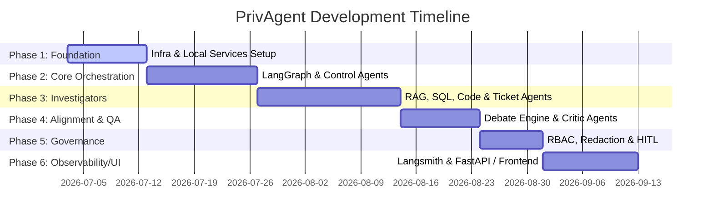

# PrivAgent: Implementation & Project Plan

This document outlines the step-by-step project plan for building and deploying **PrivAgent**, the private enterprise AI Operating System. The roadmap is structured into sequential phases, defining deliverables, tech stack dependencies, and verification criteria for each milestone.

---

## Project Roadmap Overview

---

## Phase 1: Foundation & Local Infrastructure Setup
Establish the secure local boundaries and run auxiliary services.
- [ ] **Infrastructure Orchestration:**
  - Create a unified `docker-compose.yml` to run:
    - **PostgreSQL** (for LangGraph persistence and Langsmith metadata).
    - **Qdrant** (for vector storage).
    - **Neo4j** (for relational knowledge graphs).
- [ ] **Local Inference Serving:**
  - Setup **vLLM** and **Ollama** containers to host `Qwen-2.5-Instruct` (general agent logic) and `DeepSeek-Coder-V2` (code analysis).
  - Configure GPU passthroughs for local hardware acceleration.
- [ ] **Verification:**
  - Run database connection checks and benchmark local model inference token generation speeds.

---

## Phase 2: Core Orchestration (LangGraph Engine)
Implement the central routing and state machine loop.
- [ ] **Graph State Schema:** Define the shared LangGraph `State` class containing task lists, intent data, intermediate agent outcomes, audit logs, and security clearances.
- [ ] **Intent Agent:** Write system prompts to decompose user requests into capability target matrices.
- [ ] **Planning Agent:** Create the dynamic planner that builds a task Directed Acyclic Graph (DAG) and handles failures by routing back to replanning steps.
- [ ] **PostgreSQL Saver (`PostgresSaver`):** Connect LangGraph checkpointing to Postgres to allow long-lived runs and execution suspends.
- [ ] **Verification:**
  - Mock downstream agents and verify that the Planning Agent correctly routes and recovers from simulated subtask execution failures.

---

## Phase 3: Investigator Agents & Tool Integrations
Connect the AI nodes to enterprise data sources.
- [ ] **Knowledge Agent (Unstructured Data):**
  - Implement sparse (BM25) and dense (Qdrant vector) similarity search.
  - Integrate a local cross-encoder re-ranking pipeline.
- [ ] **Database Agent (Structured Data):**
  - Construct SQL schema inspectors.
  - Implement read-only sandbox database connections to execute generated SQL queries safely.
- [ ] **Code Agent (Repositories):**
  - Build AST parser scripts and grep wrappers.
  - Integrate git utilities for viewing commit diffs.
- [ ] **Ticket Agent (Jira/ServiceNow):**
  - Setup API clients to query and format issue telemetry.
- [ ] **Verification:**
  - Query each agent individually using unit test scripts with predefined mock data.

---

## Phase 4: Reasoning, Debate & Quality Assurance
Mitigate hallucinations and confirm factual correctness.
- [ ] **Debate Engine:**
  - Build specialized agent roles (e.g., Product-centric, Operations-centric).
  - Implement the multi-perspective prompt loop.
- [ ] **Judge Agent:** Write a synthesis node that reconciles differences and discards arguments lacking verifiable sources.
- [ ] **Critic Agent:** Add logic checking generated responses against original context chunks and database row summaries.
- [ ] **Verification:**
  - Feed contradictory information to the investigators and verify the Judge outputs a balanced, evidence-backed summary.

---

## Phase 5: Security, RBAC & Human-in-the-Loop (HITL)
Enforce absolute enterprise security and governance.
- [ ] **Security Agent:**
  - Implement a middleman node to review inputs for unauthorized attempts.
  - Write regex-based and classifier-based PII masking systems.
  - Limit tools based on user roles (Role-Based Access Control).
- [ ] **Human-in-the-Loop (HITL):**
  - Implement LangGraph interruption checkpoints for write activities.
  - Build an approval payload structure (Approve / Modify / Reject).
- [ ] **Verification:**
  - Test routing a write query and confirm the execution graph halts, waits for external input, and correctly resumes or aborts upon simulated manual feedback.

---

## Phase 6: Observability, APIs & Frontend
Create interfaces and self-hosted monitoring.
- [ ] **FastAPI Integration:** Build asynchronous web endpoints for starting tasks, fetching state logs, and sending approvals.
- [ ] **Langsmith Observability:** Setup Langsmith self-hosted instances connected to PostgreSQL to track prompts, parameters, and trace agent execution paths.
- [ ] **Web UI Dashboard:** Build a responsive interface for entering goals, viewing the live execution DAG, reading agent chat logs, and confirming HITL requests.
- [ ] **Verification:**
  - Inspect trace outcomes in Langsmith and verify frontend graph visualizations load successfully.

---

## Phase 7: Validation & Production Deployment
Prepare the platform for enterprise rollouts.
- [ ] **End-to-End Testing:** Write regression suites covering complex multi-step scenarios (e.g., debugging an outage ticket, querying logs, drafting a post-mortem, and notifying developers).
- [ ] **Kubernetes Manifests:** Create Helm charts to facilitate deploying all microservices (vLLM, PostgreSQL, Neo4j, Qdrant, FastAPI, Web UI) to on-premise clusters.
- [ ] **Documentation:** Finalize operator setup guides, security policies, and user manuals.
